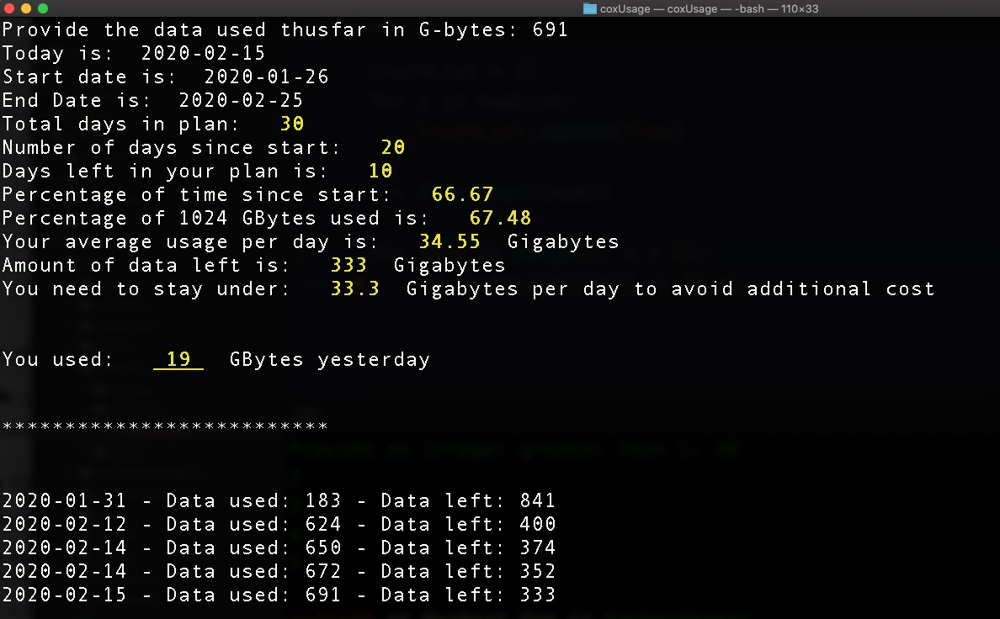

# coxUsage
Just a lil' python fun!

if coxData == only 1024G per month and I'm == 'a penny pincher' and coxPriceIncreaseWhen > 1024G:
write a python script to track usage!

I'll be updating this README with a better version when it isn't a holiday weekend :)

